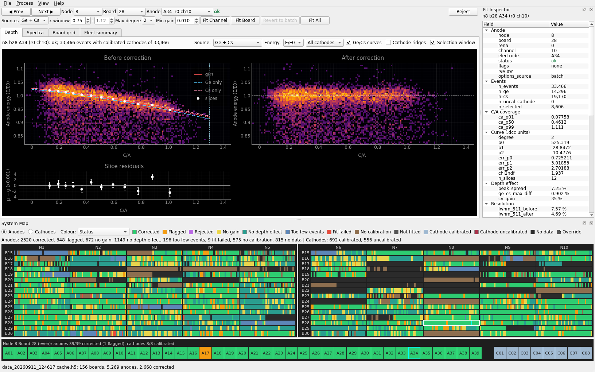
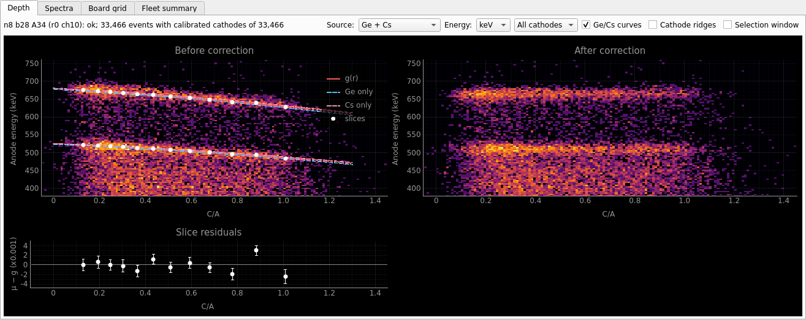
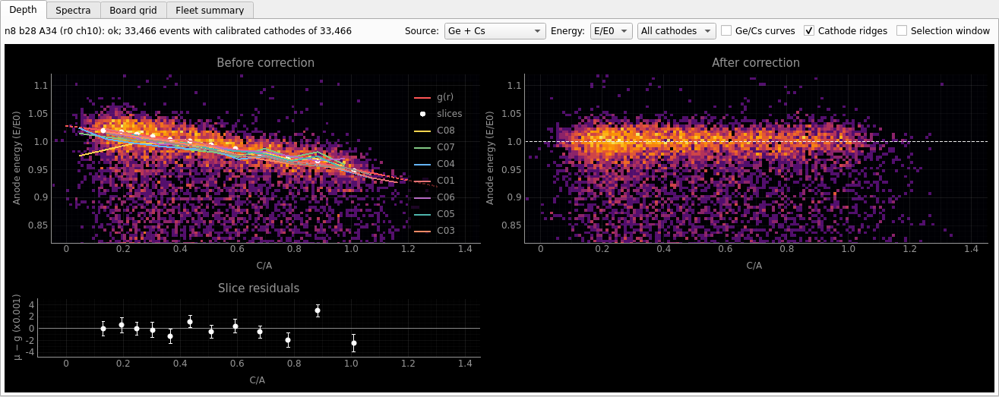
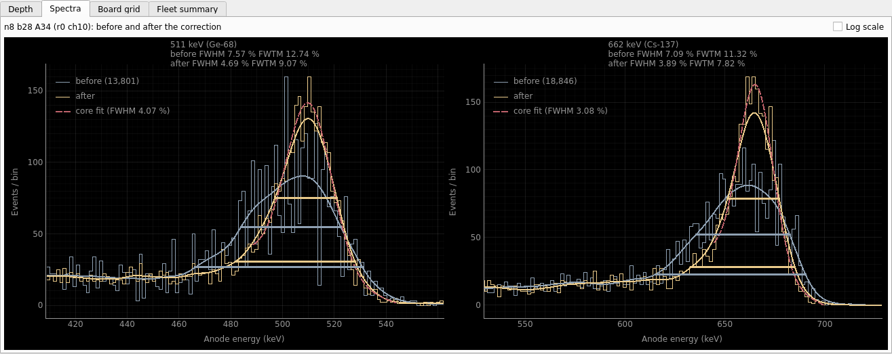
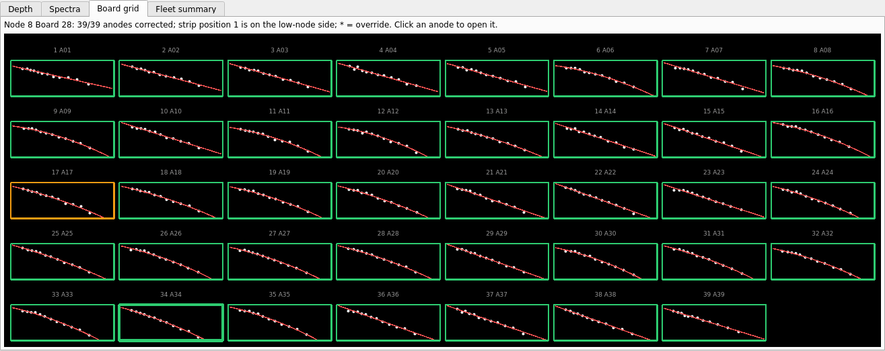
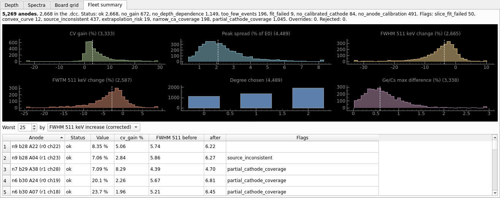
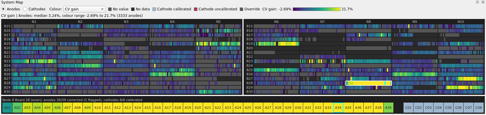
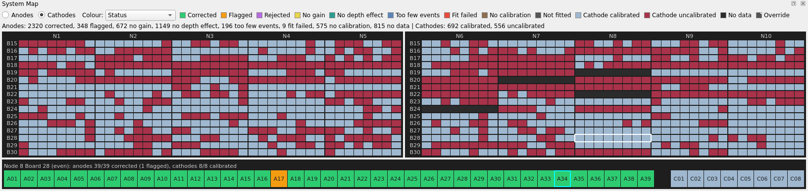

# dcalib GUI: user guide

`dcalib-gui` shows the depth calibration of every anode, re-fits anodes or boards with other
options, records which corrections to reject, and exports the `.dcc` and `depth_summary.csv`. It
follows the uvcorr and adc2kev GUIs: docks with saved positions, `QSettings` persistence, `QThread`
workers with Stop, and a System Map forked from uvcorr's. For the method see
[ALGORITHM.md](ALGORITHM.md); for the CLI, the sidecar results file and the output formats see the
[README](../README.md).



*The test cache with its stored results, in the default window on a 1920 x 1200 screen. The
Depth tab shows n8 b28 A34 (r0 ch10): 33,466 1A1C events, 8,606 in the photopeak selection, a
degree-2 curve from 12 slices, FWHM at 511 keV 7.57 → 4.69 %. The Fit Inspector is on the right,
the System Map in Status mode at the bottom, with board N8 B28 magnified in the strip. All images
in this guide are rendered by `scripts/gui_screenshots.py`.*

---

## 1. Starting

```bash
dcalib-gui                                   # empty window: File > Open Cache...
dcalib-gui data.cache.h5                     # open a cache and the results in its sidecar
dcalib-gui data.cache.h5 --results r.depth.h5  # results stored elsewhere
dcalib-gui data.cache.h5 --kev calibration.kev # calibrations from a .kev file
dcalib-gui --workers 4 data.cache.h5         # Fit All with 4 processes (default min(8, usable CPUs))
dcalib-gui -v data.cache.h5                  # log to stderr (-v info, -vv debug)
```

`--results` and `--kev` apply to every cache opened in the session. Ctrl+C in the terminal closes
the window the same way as *File > Quit*: running work is stopped, and the layout is saved.

## 2. Window layout

| Part | Content |
|------|---------|
| Menu bar | **File**, **Process**, **View**, **Help** (2.1) |
| Stale banner | Only when the stored results are stale (section 11) |
| Control band | Navigation, the anode's status, Reject; the fit options and buttons (2.2) |
| Central tabs | **Depth**, **Spectra**, **Board grid**, **Fleet summary** (section 5) |
| Right dock | **Fit Inspector** (section 6) |
| Bottom dock | **System Map** (section 7) |
| Status bar | Messages; a progress bar during Fit All |

The window title is `dcalib-gui - <cache file name>`. After opening, the status bar says what is
open, e.g. *data_20260911_124617.cache.h5: 156 boards, 5,269 anodes, 2,668 corrected*.

### 2.1 Menus

| Menu | Entry | Shortcut | Effect |
|------|-------|----------|--------|
| File | Open Cache... | Ctrl+O | Section 3 |
| | Export .dcc and CSV... | Ctrl+E | Section 12 |
| | Quit | Ctrl+Q | Stop running work, save the layout, close |
| Process | Fit All | Ctrl+F | Section 8 |
| | Fit Channel | Ctrl+R | Re-fit the selected anode with the band's options (section 9) |
| | Fit Board | Ctrl+Shift+R | Re-fit every anode of the selected anode's board (section 9) |
| | Revert Channel to batch | | Delete the selected anode's override (section 9.3) |
| | Revert Board to batch | | Delete every override of its board (section 9.3) |
| | Stop | Esc | Stop Fit All or a re-fit; nothing is stored |
| View | Fit Inspector, System Map | | Show or hide the dock |
| | Reset Layout | | Default window size and dock positions (2.3) |
| Help | About dcalib-gui | | Version |

Entries that cannot run are disabled: Fit All before a cache is open, the re-fits before there
are valid batch results or without a selected anode (the band's buttons give the reason in their
tooltip, section 9), Revert without an override, Export without results, and, while an operation
runs, everything except Stop and Quit.
Ctrl+Left / Ctrl+Right select the previous / next anode (section 4).

### 2.2 Control band

```
Row 1:  [◀ Prev] [Next ▶] Node [8 ▾] Board [28 ▾] Anode [A34  r0 ch10 ▾]  ok  (flags)          [Reject]
Row 2:  Sources [Ge + Cs ▾] x window [0.75]–[1.12] Max degree [2 ▾] Min gain [0.010]
        [Fit Channel] [Fit Board] [Revert to batch] [Fit All]
```

| Widget | Meaning |
|--------|---------|
| Prev / Next | The previous / next anode in (node, board, rena, channel) order, across boards (Ctrl+Left / Ctrl+Right) |
| Node, Board, Anode | Selectors over the boards with events. The anode list holds the board's anodes with a result (all 39 before the first Fit All), labelled `A34  r0 ch10`. Changing the node or board selects that board's first anode |
| Status | The anode's status in its System Map colour, `(rejected)` when rejected, then its flags; `not fitted` without a result |
| Reject | Checkable: checked (*Rejected*) means the anode is left out of the `.dcc` (section 10) |
| Sources | Fit Ge-68 (511 keV), Cs-137 (662 keV) or both photopeaks |
| x window | The photopeak selection `x_lo`–`x_hi` in E/E0 |
| Max degree | Highest degree of g(r): 0, 1 or 2 |
| Min gain | Minimum `cv_gain` to accept a correction |
| Fit Channel, Fit Board, Revert to batch | Section 9 |
| Fit All | Section 8 |

The band's options are the ones the next fit uses. On opening a cache with valid results they
become the stored batch's options; otherwise the band keeps its options (the defaults at start-up).
Options not in the band keep those values. They are not saved between sessions.

### 2.3 Docks and default layout

Both docks can be hidden (View menu), floated or moved. On first launch the window takes 85 % of
the available screen, capped at 1920 x 1200; it opens maximized when the available height
is below 900 px or 85 % would be too close to the window's minimum size. The System Map gets 38 %
of the window height and the Fit Inspector 22 % of its width. The layout is saved on exit
(section 13); *View > Reset Layout* applies the defaults again.

---

## 3. Opening a cache

*File > Open Cache...* (Ctrl+O) opens an adc2kev calibration cache (`*.cache.h5`). The cache is
opened read-only. Opening runs in a thread and takes about 2 s for the test cache (reading the
calibrations dominates):

1. The cache is checked (an HDF5 file with adc2kev's layout), the calibrations are loaded from it
   or from `--kev`, and fingerprinted.
2. The sidecar results file is read: `<cache stem>.depth.h5` next to the cache, or `--results`.
3. The results are compared with the cache and the calibrations (section 11).

| Situation | What you see |
|-----------|--------------|
| Valid stored results | The map, the tabs and the inspector show them at once; the first anode is selected; the band shows the stored batch options |
| No results file | Every anode of a board with events is *not fitted*; the Depth and Spectra tabs show the raw events. Run *Process > Fit All* |
| Stale results | Shown as stored, with the stale banner (section 11) |
| Not a file, not HDF5, not an adc2kev cache, a bad `.kev` | Error dialog *Cannot open the cache*, with the reason |
| A results file that cannot be decoded, or one locked by another process for more than 1 s | Error dialog with the reason |

The sidecar is not created by opening; the first Fit All creates it.

---

## 4. Navigating

An anode can be selected from:

- the **System Map**: click an anode cell (a cathode cell only reports its calibration status in
  the status bar), or a board tile to select its first anode;
- the **selectors** and **Prev / Next** of the band (Ctrl+Left / Ctrl+Right);
- the **board strip** under the map, with the keyboard (section 7.5);
- a cell of the **Board grid** or a row of the **Fleet summary** table.

The band, the map, the Fit Inspector and the Board grid follow the selection at once. The Depth
and Spectra tabs need the anode's events, which are loaded in a thread: 0.3-1.0 s when its board
is not loaded yet, under 0.1 s for another anode of a loaded board (the last 4 boards are kept in
memory). While loading, the Depth tab's title says *(loading...)*; selecting another anode in the
meantime discards the pending load.

A board without events (a dark tile), or an anode without a 1A1C event of its own (*No data* on a
board with results), selects no anode: the band, the tabs and the inspector say *Node 9 Board 30:
no events on this board* or *… no 1A1C events*, and the re-fits are disabled. The map keeps its
cursor there, so a keyboard sweep along the boards or nodes (section 7.5) carries on past it.

---

## 5. Tabs

### 5.1 Depth



*The same anode in keV: both photopeaks, at 511 and 662 keV, fall with C/A by the same fraction;
after the correction both are flat. The Ge-only and Cs-only curves lie on the pooled one.*

Three plots of the selected anode's events (calibrated anode and cathode, one anode and one
cathode per event), with C/A on the horizontal axis:

| Plot | Content |
|------|---------|
| **Before correction** | 2D histogram of r = C/A against the anode energy (log colour scale); the curve g(r), solid over the 1-99 % C/A range of the data and dotted where consumers extrapolate it (down to 0 and up to 1.3); the pooled slice points ± their errors; optionally the Ge-only and Cs-only curves (dashed) and the selection window (dashed box) |
| **After correction** | The corrected energies `x / g(r)`: a good correction gives a flat ridge on the dashed line at 1. For an anode that is not corrected, the raw energies again, and the title says *(not corrected: raw)* |
| **Slice residuals** | The slice points minus the curve, μ_i − g(r_i), ± their errors |

The r axes of the three plots and the energy axes of the two histograms are linked: zooming one
zooms the others (mouse wheel; drag with the right button; *View All* in the right-click menu).

The line above the plots gives the anode, its status (with *rejected* and *override*), and how many
events have a calibrated cathode. An orange line below it says how many events were dropped for an
uncalibrated cathode, and when the anode is not in the `.dcc`.

| Control | Effect |
|---------|--------|
| Source | *Ge + Cs*, *Ge-68 (511 keV)* or *Cs-137 (662 keV)* events |
| Energy | *E/E0* (x = A/E0, both photopeaks at 1) or *keV* (both photopeaks, at 511 and 662 keV, each with its own copy of the curve) |
| Cathode filter | *All cathodes*, or one of the anode's cathodes with its event count |
| Ge/Cs curves | The curves fitted to each source alone (from the stored slices; absent when a source has too few events) |
| Cathode ridges | Section 5.1.1 |
| Selection window | The fit's `x_lo`–`x_hi` by `r_lo`–`r_hi` box (E/E0 only) |

These settings except the cathode filter are saved (section 13).

#### 5.1.1 Cathode ridges



*Each cathode's ridge in its own colour. C08 (yellow) falls below the others at low C/A.*

The ridge of a cathode is the median energy of the anode's photopeak events (x in 0.88-1.10)
with that cathode, in 14 r bins over [0, 1.3] (bins with fewer than 15 events are left out;
cathodes with fewer than 150 events are not drawn). All cathodes of an anode should follow the
same curve. A cathode whose keV calibration is off stretches or shifts r, and its ridge stands
apart from the others: a reason to check that cathode's calibration before trusting the curve.
Use the cathode filter to see its events alone.

### 5.2 Spectra



*The same anode: at 511 keV the FWHM goes from 7.57 to 4.69 % and the FWTM from 12.74 to
9.07 %; at 662 keV from 7.09 to 3.89 % and from 11.32 to 7.82 %.*

Two panels, 511 keV (the Ge-68 events) and 662 keV (the Cs-137 events), of the events of the Depth
tab with C/A in the fit's range:

- the energy histograms before (grey-blue) and after (yellow) the correction, in 0.25 % of E0
  bins;
- the smoothed spectra the widths are measured on (thick lines);
- the FWHM and FWTM, drawn where they are measured: horizontal bars between the crossings, at half
  and a tenth of the net peak height above the continuum;
- the Gaussian-core fit of the corrected photopeak (dashed), with its FWHM in the legend.

The panel titles list the FWHM and FWTM before and after; they are the `fwhm_*` and `fwtm_*`
columns of `depth_summary.csv`. An anode that is not corrected shows its raw spectrum only. *Log
scale* switches the vertical axes to a log scale and is saved.

### 5.3 Board grid



*Board N8 B28: all 39 anodes corrected; A17 (orange frame) is flagged `source_inconsistent`; A34,
the selected anode, has the thicker frame.*

The 39 anodes of the selected anode's board in physical strip order (position 1 on the low-node
side), eight to a row. Each cell shows the stored pooled slice points and the curve g(r), framed
in the anode's System Map status colour (thicker for the selected anode); its title gives the strip
position, the electrode label and `*` for an override. All cells share one vertical range (the
2-98 % range of the board's slice points, widened a little), so the curves can be compared at a
glance. Everything comes from the stored results: nothing is loaded or refitted. Click a cell to
open that anode.

### 5.4 Fleet summary



The whole detector from the stored results (with the overrides and the review applied):

- **Counts**: anodes, how many are in the `.dcc`, per status, per flag, overrides and rejections.
- **Histograms** (40 bins over the 0.5-99.5 % range, the median dashed): `cv_gain` (every anode
  with a value), `peak_spread` (every fitted anode), the relative change of the FWHM and the FWTM at
  511 keV of the corrected anodes, the degree chosen, and `ge_cs_max_diff`.
- **Worst N** (5-500, default 25) anodes by a criterion: the largest FWHM increase at 511 or
  662 keV or FWTM increase at 511 keV of a corrected anode, the lowest `cv_gain` of a corrected
  anode, the largest peak spread, Ge/Cs difference or curve χ²/ndf. The table (anode, status,
  value, `cv_gain`, FWHM 511 keV before and after, flags) sorts by any column; click a row to open
  the anode.

---

## 6. Fit Inspector

Every field of the selected anode's result, grouped as **Anode** (address, electrode, status,
flags, review, options source), **Events**, **C/A coverage**, **Curve (.dcc units)**, **Depth
effect** and **Resolution**: the columns of `depth_summary.csv`, in the same units (fractions shown
in %). The status is in its map colour. Below them:

- **Flags explained**: each flag with a sentence that uses the anode's options, e.g.
  *The Ge-only and Cs-only curves differ by more than 1.0% (and 3 sigma) over the 10-90 % r range.*
- **Review**: the state and the note of a rejected anode.
- **Options (batch)** or **Options (override (own options))**: every option the result was fitted
  with; values that differ from the defaults are bold, with the default in the tooltip.

Without a result the inspector says *not fitted (run Process > Fit All)*.

---

## 7. System Map



*CV gain mode: anodes coloured by `cv_gain` on viridis (2nd-98th percentile range, here -2.69 % to
21.7 % over 3,333 anodes); anodes without a value are grey. Board N8 B28 stands out with gains
of 10-35 %.*

The map shows both detector panels, five nodes wide and sixteen boards high each, with every board
tile split into its 39 anode or 8 cathode cells in physical strip order. The board strip underneath
magnifies the selected board with all its electrodes. Hovering over a cell shows its tooltip
(section 7.3).

### 7.1 Views and colour modes

**Anodes / Cathodes** switches the grid between the two electrode kinds (the strip always shows
both). **Colour** picks the mode:

| Mode | Anode colour |
|------|--------------|
| Status | Its category (7.2) |
| CV gain | `cv_gain` |
| Peak spread | `peak_spread` |
| FWHM 511 keV | `fwhm_511_after` |
| FWHM 662 keV | `fwhm_662_after` |
| FWHM 511 change | `fwhm_511_after / fwhm_511_before − 1` |
| Ge/Cs difference | `ge_cs_max_diff` |

In a metric mode the colour bar shows the metric's range (the 2nd to 98th percentile of the
values, over all anodes; values outside take the end colours), and anodes without a value are
*No value* grey. **Cathodes are always coloured by their keV calibration**, in every mode.



*The cathode view: 692 of 1,248 cathodes have a keV calibration (blue); the others (red) cannot be
used, so their anodes lose those events. Some boards have none at all.*

### 7.2 Status categories

| Category | Anodes |
|----------|--------|
| Corrected | `ok`, no flag that needs a look |
| Flagged | `ok` with `convex_curve`, `source_inconsistent` or `extrapolation_risk` (still in the `.dcc`) |
| Rejected | Rejected in the review, whatever the status (not in the `.dcc`) |
| No gain | `no_gain` |
| No depth effect | `no_depth_dependence` |
| Too few events | `too_few_events` |
| Fit failed | `fit_failed` |
| No calibration | `no_anode_calibration` or `no_calibrated_cathode` |
| Not fitted | Events but no result: before the first Fit All |
| No data | No 1A1C event, or a board without data |
| Cathode calibrated / uncalibrated | Cathodes, by keV calibration |

`slice_fit_failed`, `narrow_ca_coverage` and `partial_cathode_coverage` are informational: an `ok`
anode with only those flags is *Corrected*. An override cell has a small white corner tick (drawn
wherever the cell is at least 6 px wide, as in the strip), listed in the legend as *Override*.

The summary line under the legend counts the categories, e.g. *Anodes: 2320 corrected, 348
flagged, 672 no gain, … | Cathodes: 692 calibrated, 556 uncalibrated*, or in a metric mode the
median and the colour range. The strip's header summarises its board, e.g. *Node 8 Board 28
(even): anodes 39/39 corrected (1 flagged), cathodes 8/8 calibrated*. Boards with data outside the
mapped grid, or results on channels that are not electrodes, are listed in a warning line.

### 7.3 Tooltips

An anode's tooltip gives its label and strip position, the address, the status, the review, the
flags, the options source and every metric it has: events, selected events, degree, `cv_gain`,
peak spread, the FWHM at 511 and 662 keV, the FWHM change and the Ge/Cs difference. A cathode's
gives its address and keV calibration status.

### 7.4 Context menu

Right-click a cell or a board:

| Entry | When | Effect |
|-------|------|--------|
| Fit Channel `A34 (RENA 0 Ch 10)` | On an anode | Re-fit it with the band's options (section 9) |
| Fit Board `Node 8 Board 28` | Always | Re-fit the board's anodes |
| Reject... / Unreject | On an anode with a result | Section 10 |
| Revert Channel to batch | On an anode with an override | Section 9.3 |
| Revert Board `Node 8 Board 28` | On a board with overrides | Section 9.3 |

The right-clicked cell is selected while the menu is open; dismissing the menu restores the
previous selection.

### 7.5 Board strip keys

Click the strip to give it the keyboard focus. Then:

| Keys | Effect |
|------|--------|
| Left / Right | Previous / next electrode along the board |
| Home / End | First / last electrode |
| Up / Down | Same position on the board above / below |
| Ctrl+Left / Ctrl+Right | Same board and position on the previous / next node, along 1..10 (10 → 1 wraps) |
| Ctrl+Shift+Left / Ctrl+Shift+Right | Same board and position on the other panel (node ± 5) |

While the strip has the focus, Ctrl+Left / Ctrl+Right step nodes; anywhere else they select the
previous / next anode.

---

## 8. Fit All

*Process > Fit All* (Ctrl+F, or the band's or the stale banner's button) analyses every board with
the band's options, as `dcalib process` does, in a pool of `--workers` processes (about 30 s for the
test cache with 8). The status bar shows a progress bar by boards. *Stop* (Esc) ends it: *Fit All
stopped; nothing was stored*.

When it finishes, the results replace the stored batch in the sidecar (which is created if
needed), and the status bar says e.g. *Fit All: 5,269 anodes, 2,668 corrected*. Overrides are
kept, except those that the new batch reproduces (their options now fit the same way) and all of
them when the old results were stale; the status bar adds *N override(s) dropped*. Rejections are
always kept. The map, the tabs and the inspector are refreshed and the selection is kept.

Fit All does not write the `.dcc`: export it (section 12) or run `dcalib process`.

---

## 9. Re-fits and overrides


*A17, flagged `source_inconsistent` in the batch, re-fitted with Sources = Ge-68: an override
(degree 1 from 4,998 Ge events, *ok, override* in the Depth tab, `options_source` override in the
inspector, the corner tick in the strip). A01 has been rejected (purple). The band has been set
back to the batch options.*

### 9.1 Fit Channel and Fit Board

Set the options in the band, then *Fit Channel* (Ctrl+R) re-fits the selected anode, and *Fit
Board* (Ctrl+Shift+R) every anode of its board that has a result; the map's context menu does the
same for any anode or board. A re-fit runs in a thread on the board's events (loaded if needed) and
takes 0.4-0.5 s for one anode and 0.7-1.4 s for a board, including storing and redrawing.

Each re-fitted anode's result is stored in the sidecar as an **override** with its own options and
slices, and replaces the batch result everywhere: the map (with the corner tick), the tabs, the
inspector, the Fleet summary and the exports. The status bar reports e.g. *Re-fitted n8 b28 A17
(r1 ch7): 1 override(s) stored, 1 corrected*.

If the band's options fit the same way as the stored batch's, the re-fit **reverts** the anodes
instead (their overrides are deleted): *Re-fitted … with the batch options: N override(s)
reverted*.

The re-fits need valid batch results. Otherwise the buttons are disabled and their tooltip says
why: *open a cache first*, *run Fit All first: there are no batch results to override*, *the stored
results are stale: run Fit All first*, or that an operation is running.

### 9.2 What the options change

| Option | Typical use |
|--------|-------------|
| Sources | Fit one photopeak when the two disagree (`source_inconsistent`), or when one source has too few events |
| x window | Narrow it for an anode with a strong low-energy tail or a nearby peak; widen it for a strongly curved anode |
| Max degree | Force a straight line (1) where the quadratic term follows noise at the ends |
| Min gain | Accept (lower) or refuse (raise) a small correction for this anode only |

### 9.3 Revert

*Revert to batch* (band), *Process > Revert Channel to batch* or the context menu delete the
selected anode's override; *Revert Board to batch* deletes every override of its board. The batch
result is shown again: *Reverted N override(s) of … to the batch*.

---

## 10. Review: Reject and Unreject

**Reject** (band, or *Reject...* in the map's context menu) asks for an optional note and marks the
anode *rejected*: it is left out of the `.dcc` of every later export and `dcalib process` run, shown
purple on the map and *(rejected)* in the band. Unchecking **Rejected** (or *Unreject*) restores
it. The decision is stored in the sidecar at once, with a time stamp and the note (shown in the
Fit Inspector's Review group).

Rejections belong to the channel, not to a fit: they survive new batches, re-fits and stale
results, and `dcalib process` lists them in its census. `dcalib process --discard-review` drops
them all.

---

## 11. Stale results

The stored results are stale when the cache is not the one they were computed from (its size,
adc2kev creation time or source hashes differ; moving or touching the cache does not matter) or
the keV calibration changed (another fingerprint, e.g. another `--kev`). A banner above the band
then says so, with the reasons:

> The stored results are stale: the keV calibration changed. They are shown as stored; overrides do
> not apply and re-fits are disabled until Fit All replaces them. Rejections are kept.

The banner's **Fit All** button runs Fit All (section 8), which replaces the results and drops the
overrides. Until then the stored batch rows are shown, Reject still works, and an export is
possible (the status bar adds *(from stale results)*).

---

## 12. Export

*File > Export .dcc and CSV...* (Ctrl+E) asks for a directory (the last one is remembered) and
writes `<cache stem>.dcc` and `depth_summary.csv` of the results as shown: overrides applied,
rejected anodes left out of the `.dcc`, the CSV header recording the cache, the calibration, the
batch options and the results file. Files of the same names in that directory are replaced (each
is written to a temporary file first and then renamed). The status bar reports e.g. *Exported
2,668 corrected anodes to data_20260911_124617.dcc and 5,269 rows to depth_summary.csv in
/path/out*. The formats are in the README.

---

## 13. Settings

The GUI keeps its settings in `~/.config/dcalib/dcalib-gui.ini`:

| Setting | Saved |
|---------|-------|
| Window size, position and docks | On exit |
| Last directory of *Open Cache*, last export directory | When used |
| System Map colour mode and view | When changed |
| Depth tab: source, energy unit, Ge/Cs curves, cathode ridges, selection window | When changed |
| Spectra tab: log scale | When changed |

The band's fit options and the cathode filter are not saved. Delete the file to start from the
defaults.

---

## 14. Keyboard reference

| Keys | Where | Effect |
|------|-------|--------|
| Ctrl+O | Window | Open a cache |
| Ctrl+E | Window | Export `.dcc` and CSV |
| Ctrl+Q | Window | Quit |
| Ctrl+F | Window | Fit All |
| Ctrl+R / Ctrl+Shift+R | Window | Fit Channel / Fit Board |
| Esc | Window | Stop Fit All or a re-fit |
| Ctrl+Left / Ctrl+Right | Window (outside the board strip) | Previous / next anode |
| Left / Right, Home / End | Board strip | Along the board |
| Up / Down | Board strip | Board above / below |
| Ctrl+Left / Ctrl+Right | Board strip | Previous / next node |
| Ctrl+Shift+Left / Ctrl+Shift+Right | Board strip | Other panel |

---

## 15. Messages and what to do

| Message | Cause and remedy |
|---------|------------------|
| *… is in use by another process* | Another dcalib (a `dcalib process` run, a second GUI) holds the sidecar's HDF5 lock. Wait for it and try again |
| *The stored results in … changed since they were loaded* | Another process replaced the batch while this window was open; a re-fit or revert would have attached to the wrong batch. Reopen the cache |
| *Fit All failed: The results could not be stored: cannot write the results file …* | The sidecar's location is not writable (checked before the analysis starts): start the GUI with `--results PATH` |
| *Unavailable: run Fit All first: there are no batch results to override* (button tooltip) | Run *Process > Fit All* first |
| *N events dropped: their cathode has no keV calibration* (Depth tab) | Those cathodes are red in the cathode view; the fix is in the adc2kev calibration, not here |
